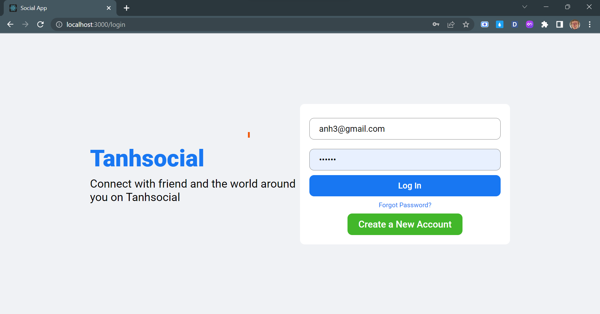
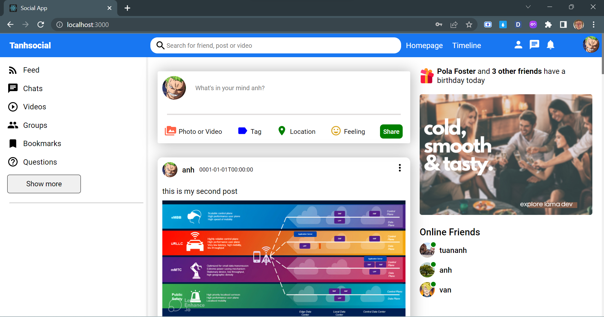
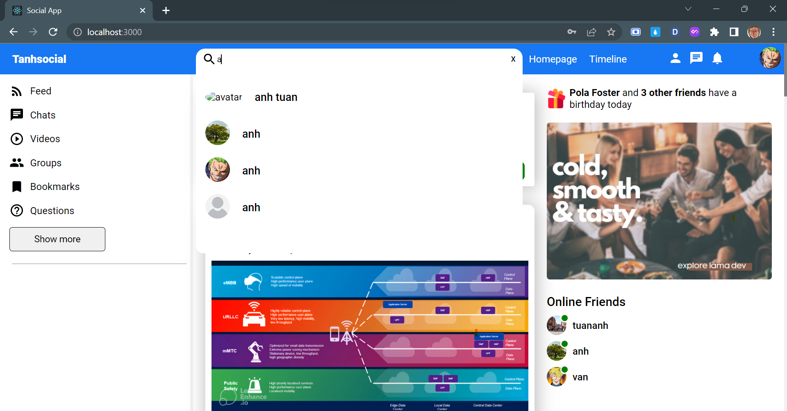
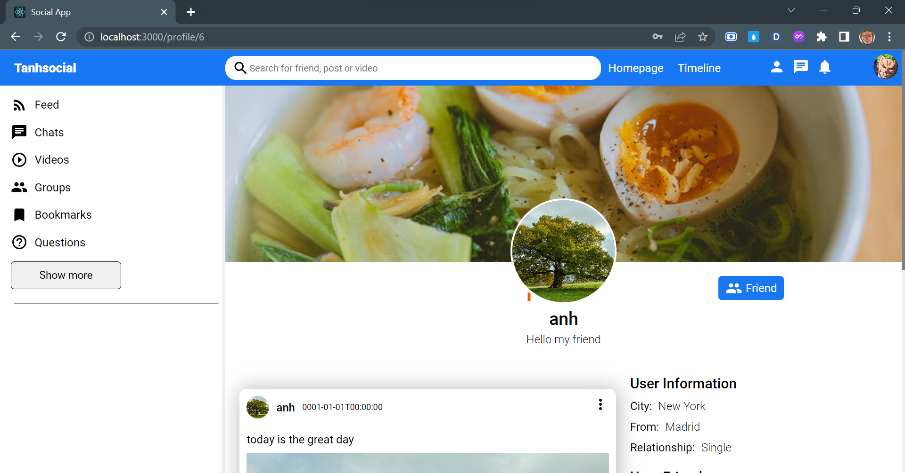
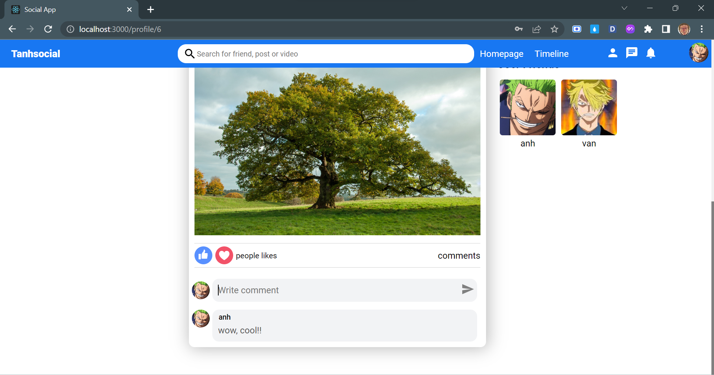
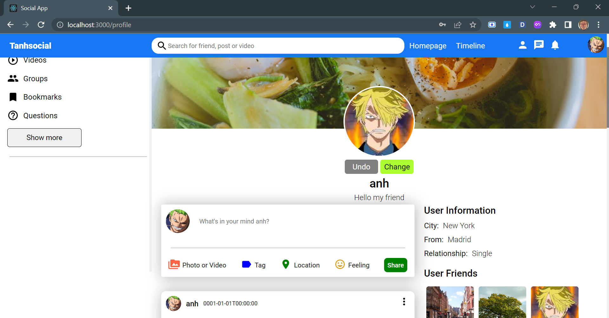
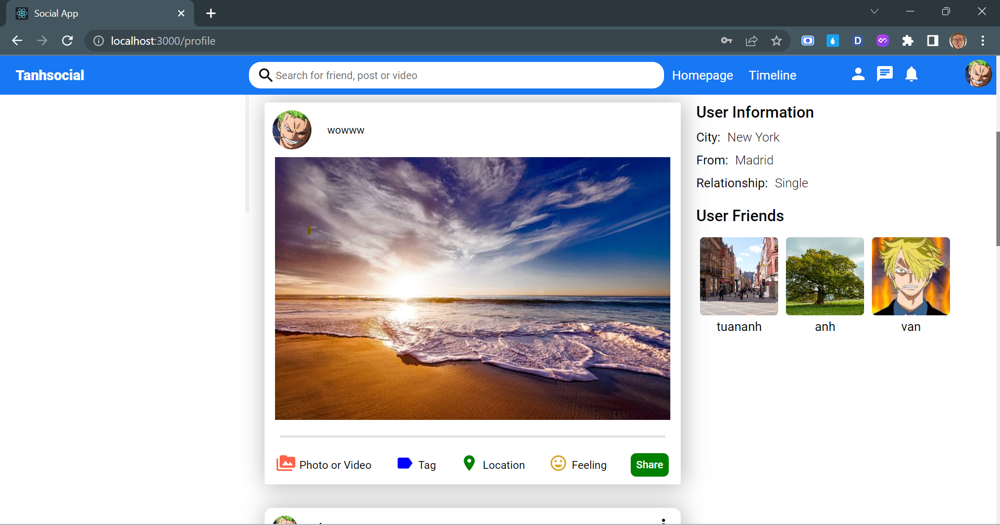

# Social Media app
   - BackEnd: ASP .NET, SQLServer
   - FrontEnd: HTML, CSS, ReactJs.
## Features:
- Write APIs for functions like CRUD
- Login, register
- Share, comment post
- Search user and see profile
- Add/Accept friend
- Change avatar

## ScreenShot

- Login page

- Home page

- Type username to into search input

- See profile of another user

- Type comment

- Change avatar

- Share a post

